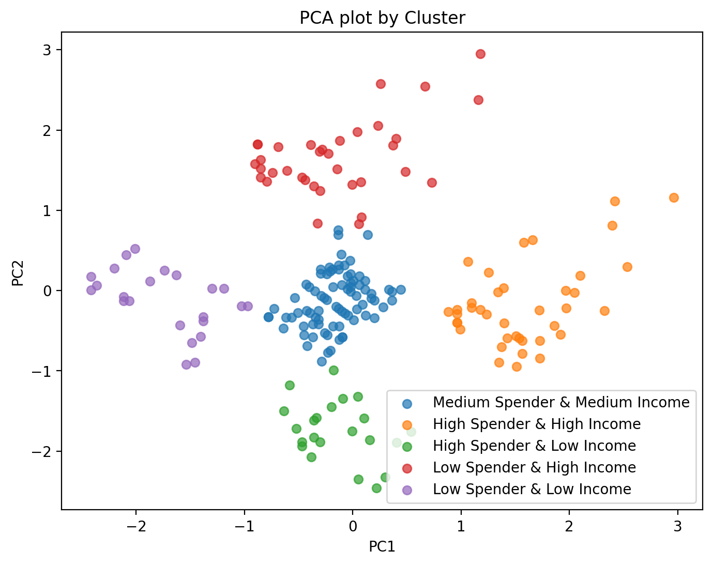
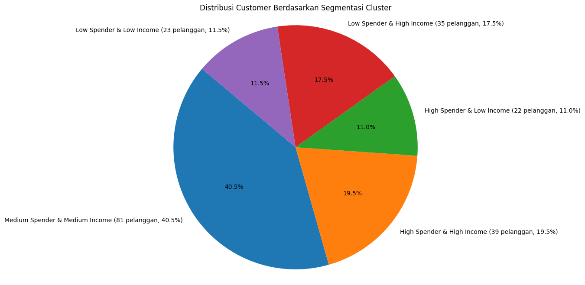

# 🛍️ Customer Segmentation Dashboard – Mall Customer Dataset

## 1. Deskripsi Singkat

Project ini bertujuan melakukan segmentasi pelanggan mall berbasis data demografi dan perilaku belanja menggunakan teknik clustering unsupervised. Hasilnya divisualisasikan dalam bentuk dashboard interaktif untuk mendukung strategi marketing dan program loyalitas yang lebih tepat sasaran.

## 2. Business Problem

Bagaimana cara membagi pelanggan mall ke dalam segmen-segmen yang homogen sehingga tiap segmen bisa diberi perlakuan marketing yang lebih efektif? Segmentasi pelanggan yang tepat akan meningkatkan loyalitas, efektivitas promosi, dan potensi revenue.

## 3. Dataset

- **Mall Customers Dataset** – [Kaggle Link](https://www.kaggle.com/datasets/vjchoudhary7/customer-segmentation-tutorial-in-python)
- Fitur utama: Gender, Age, Annual Income, Spending Score

## 4. Workflow Analisis

1. Data Cleaning & EDA
2. Feature Engineering (Binning, interaksi fitur)
3. Preprocessing (Scaling & Encoding)
4. Clustering (KMeans, evaluasi Elbow & Silhouette)
5. Visualisasi PCA
6. Interpretasi & insight bisnis
7. Dashboard interaktif (Streamlit)

## 5. EDA & Insight Awal

- Mayoritas pelanggan adalah **perempuan**.
- Usia pelanggan didominasi kelompok **young adult**.
- Terdapat customer dengan **spending tinggi meski income rendah** – potensi target promo.
- Tidak ditemukan outlier signifikan pada data.

## 6. Preprocessing & Clustering

- Data numerik distandarisasi (`StandardScaler`)
- Fitur kategori di-encode (`OneHotEncoder`)
- KMeans digunakan, jumlah cluster optimal = **5** (berdasarkan Elbow & Silhouette Score)
- PCA digunakan untuk visualisasi hasil cluster

## 7. Hasil Segmentasi & Visualisasi

- **5 segmen pelanggan** terbentuk:
  - **Medium Spender & Medium Income**
  - **High Spender & High Income**
  - **High Spender & Low Income**
  - **Low Spender & High Income**
  - **Low Spender & Low Income**
- Hasil clustering:

  

- Distribusi Customer berdasarkan Cluster:

  

## 8. Business Insight & Rekomendasi

- **High Spender & High Income:** Targetkan promo eksklusif dan layanan spesial.
- **High Spender & Low Income:** Fokus pada promo cicilan atau produk harga terjangkau.
- **Low Spender & High Income:** Kenalkan produk baru dan layanan kenyamanan.
- **Low Spender & Low Income:** Promo sederhana & event mall.

> Dashboard memungkinkan tim bisnis mengeksplorasi tiap segmen, melihat data, dan mengambil keputusan strategis secara cepat dan interaktif.

## 9. Demo Dashboard

- [Link demo dashboard](https://your-app-link.com)
- Untuk menjalankan dashboard lokal:

  ```
  pip install -r requirements.txt
  streamlit run dashboard.py
  ```

## 10. Credit & Kontak

Dikembangkan oleh: Sanjukin Pinem  
[LinkedIn](https://www.linkedin.com/in/sanjukin-pinem/) | [Email](sanju329121@gmail.com)

---
